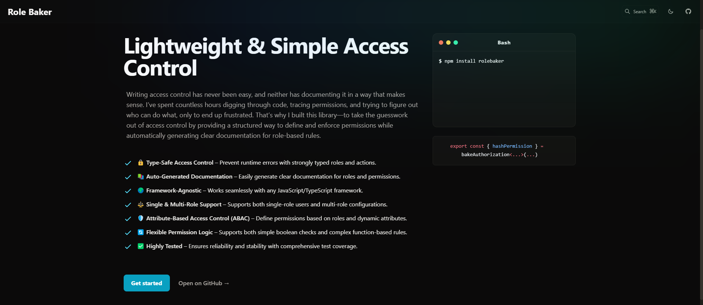

# RoleBaker

I’ve spent countless hours digging through code, tracing permissions, and trying to figure out who can do what, only to end up frustrated. That’s why I built this library, to take the guesswork out of access control by providing a structured way to define and enforce permissions while automatically generating clear documentation for role-based rules.

**RoleBaker** is a flexible library for handling **Attribute-Based Access Control (ABAC)** with type safety in a **framework-agnostic** way. It simplifies managing user permissions and generating automatic documentation, providing a clear and structured approach to handling user roles and resource actions.

## Pros

- **🔒 Type-Safe Access Control** – Prevent runtime errors with strongly typed roles and actions.
- **📚 Auto-Generated Documentation** – Easily generate clear documentation for roles and permissions.
- **🌍 Framework-Agnostic** – Works seamlessly with any JavaScript/TypeScript framework.
- **⚖️ Single & Multi-Role Support** – Supports both single-role users and multi-role configurations.
- **🛡️ Attribute-Based Access Control (ABAC)** – Define permissions based on roles and dynamic attributes.
- **🔄 Flexible Permission Logic** – Supports both simple boolean checks and complex function-based rules.
- **✅ Highly Tested** – Ensures reliability and stability with comprehensive test coverage.

---

## 📦 Installation

To install RoleBaker, you can use npm or yarn:

```bash
npm install rolebaker
```

or

```bash
yarn add rolebaker
```

---

## **📝 Usage & Documentation**

Find usage examples for **single-role** and **multi-role** models in the official documentation:

🔗 [RoleBaker Documentation](https://role-baker.vercel.app/)




### **📖 Framework-Specific Guides**

- **React** → [Guide](https://role-baker.vercel.app/frameworks/react)
- **Angular** → [Guide](https://role-baker.vercel.app/frameworks/angular)
- **Express** → [Guide](https://role-baker.vercel.app/frameworks/express)
- **Other frameworks** → [Guide](https://role-baker.vercel.app/frameworks/other)
